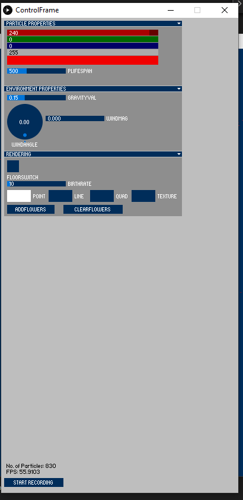

# Particle System in Processing/Java
A basic particle system that is coded with processing, a java based graphics library.  

It allows user to controll different properties of the particles (shape, number, colour, etc.) with ControlP5 GUI. Some realistic rendering effect like collision detections can be toggled on and off in the GUI provided too.  

It also allows user to control the placement and angle of the camera with keyboard command.  

## Keyboard commands
KEYBOARD UP/DOWN : Camera move forward / backward  
KEY ","/"." : Camera move left / right  
KEY "q"/"a" : Camera height up / down  
\
KEYBOARD LEFT/RIGHT: Camera turn left / right  
KEY "w"/"s" : Camera turn up / down  
\
KEY "h': Camera back to default position
## GUI control panel

## Examples with different rendering mode
* Line rendering mode with floor collision  
\
  

* Texture rendering mode  
\

